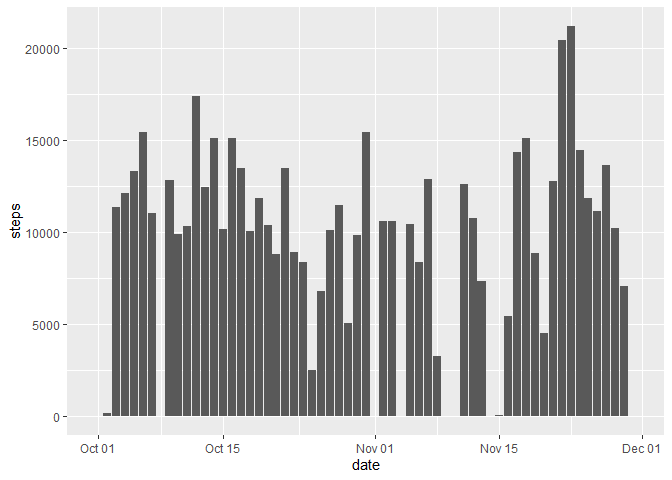
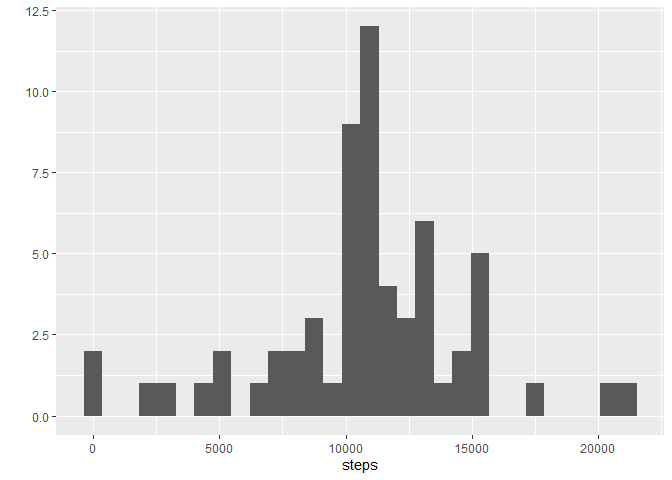
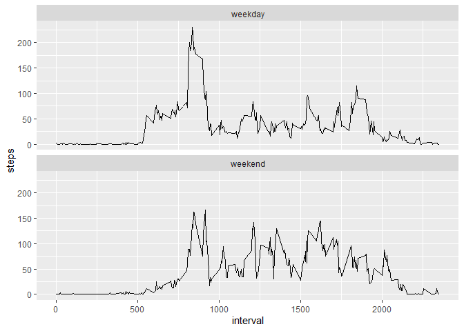

## Loading and preprocessing the data

The files are unzipped and the csv table loaded into R. `activity$date` variable is converted to `Date` format

```r
unzip("activity.zip")
activity <- read.csv("activity.csv")

activity$date <- as.Date(activity$date)

## load tidyverse, we will use several functions
library(tidyverse)
```

```
## -- Attaching packages --------------------------------------- tidyverse 1.3.1 --
```

```
## v ggplot2 3.3.3     v purrr   0.3.4
## v tibble  3.1.2     v dplyr   1.0.6
## v tidyr   1.1.3     v stringr 1.4.0
## v readr   1.4.0     v forcats 0.5.1
```

```
## -- Conflicts ------------------------------------------ tidyverse_conflicts() --
## x dplyr::filter() masks stats::filter()
## x dplyr::lag()    masks stats::lag()
```

## What is mean total number of steps taken per day?

1. Create a histogram of the total number of steps per day

```r
df.date <- activity %>%
        group_by(date) %>%
        summarise_all(~sum(., na.rm = T))

ggplot(data = df.date, aes(x = date, y = steps)) +
        geom_bar(stat = "identity")
```

<!-- -->

2. Calculate and report `mean` and `median` total number of steps per day.

```r
summary(df.date$steps)[c(3,4)]
```

```
##   Median     Mean 
## 10395.00  9354.23
```


## What is the average daily activity pattern?
1. Make a time series plot (i.e. `type = "l"`) of the 5-minute interval (x-axis) and the average number of steps taken, averaged across all days (y-axis)


```r
df.int <- activity %>%
        group_by(interval) %>%
        summarise_all(~mean(., na.rm = T))

ggplot(data = df.int, aes(x = interval, y = steps)) +
        geom_line()
```

<!-- -->

2. Which 5-minute interval, on average across all the days in the dataset, contains the maximum number of steps?

```r
df.int$interval[which.max(df.int$steps)]
```

```
## [1] 835
```
## Imputing missing values
Note that there are a number of days/intervals where there are missing
values (coded as `NA`). The presence of missing days may introduce
bias into some calculations or summaries of the data.

1. Calculate and report the total number of missing values in the dataset (i.e. the total number of rows with `NA`s)

```r
sum(is.na(activity$steps))
```

```
## [1] 2304
```
2. Devise a strategy for filling in all of the missing values in the dataset. The strategy does not need to be sophisticated. For example, you could use the mean/median for that day, or the mean for that 5-minute interval, etc.
 - We will use the interval mean calculated earlier anbd stored in `df.int`.
 
3. Create a new dataset that is equal to the original dataset but with the missing data filled in.

```r
act_imputed <- activity
to_sub <- which(is.na(activity$steps))
for (i in to_sub) {
        act_imputed$steps[i] <- df.int$steps[which(df.int$interval == act_imputed$interval[i])]
}
```


4. Make a histogram of the total number of steps taken each day and Calculate and report the **mean** and **median** total number of steps taken per day. Do these values differ from the estimates from the first part of the assignment? What is the impact of imputing missing data on the estimates of the total daily number of steps?


```r
df.imput <- act_imputed %>%
        group_by(date) %>%
        summarise_all(~sum(., na.rm = T))

ggplot(data = df.imput, aes(x = date, y = steps)) +
        geom_bar(stat = "identity")
```

<!-- -->

```r
summary(df.imput$steps)[c(3,4)]
```

```
##   Median     Mean 
## 10766.19 10766.19
```

Now the days with no data have been filled. Mean and median have both increased and are equal to 10766.19

## Are there differences in activity patterns between weekdays and weekends?

1. Create a new factor variable in the dataset with two levels -- "weekday" and "weekend" indicating whether a given date is a weekday or weekend day.


```r
act_week <- act_imputed %>%
        mutate(week = ifelse(weekdays(date) %in% c("Saturday", "Sunday"), "weekend", "weekday"))
```

1. Make a panel plot containing a time series plot (i.e. `type = "l"`) of the 5-minute interval (x-axis) and the average number of steps taken, averaged across all weekday days or weekend days (y-axis).


```r
df.week <- act_week %>%
        group_by(week, interval) %>%
        summarise_all(mean)

ggplot(data = df.week, aes(x = interval, y = steps)) +
        geom_line() +
        facet_wrap(~week, ncol =1)
```

<!-- -->
